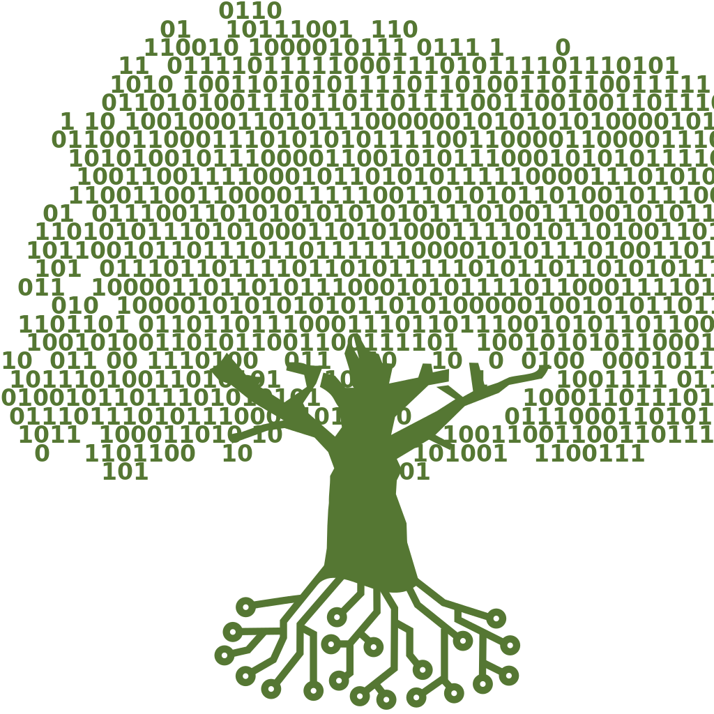

# Hello, Friend! 👋

**Ahmed BEN MORRI** — Ingénieur **Cybersécurité** · **Assistant RSSI** (environnement hospitalier)  
Profil **hybride** : gouvernance & conformité **+** sécurité opérationnelle & automatisation.  
Cap sur la **cyber cloud / GRC technique** (Azure, IAM, durcissement, SOC).

  
  

---

### Ce que je fais, concrètement
- 🩺 **Sécurité hôpital** : gestion des accès, VPN, disponibilité SI, sensibilisation & phishing  
- 🛡️ **Ops & détection** : EDR/XDR (**SentinelOne**), **Wazuh**, **Suricata**, **Splunk**, PRTG/Nagios  
- 🧰 **Admin & durcissement** : **pfSense**, VLAN, AD/GPO, Fortinet, durcissement Windows/Linux  
- 🕵️ **Offensif (bases)** : **Burp**, **Nessus/OpenVAS**, **Metasploit**, OWASP Top 10  
- ⚙️ **Automatisation** : **PowerShell** / **Python** (déploiement, logs, tâches récurrentes)  
- ☁️ **Cloud (orientation)** : bonnes pratiques **Azure**, MFA, IAM, segmentation  

---

<strong>🔧 Outils & environnements</strong>

**Sécurité / SIEM / IDS**  
Wazuh • Splunk • Suricata • SentinelOne • PRTG • Nagios • Grafana  

**Systèmes & Réseaux**  
Windows Server 2022 • Active Directory / GPO • pfSense • Fortinet • VMware • Ubuntu  

**Offensif & Audit**  
Burp Suite • Nessus • OpenVAS • Metasploit  

**Langages & Scripting**  
PowerShell • Python • Bash  

**Référentiels / Conformité**  
ISO 27001 • RGPD • HDS (santé)  

---

<strong>🎓 Parcours & objectifs</strong>

- 🎓 **M2 Cybersécurité – EPSI Paris**  
- 💼 **Assistant RSSI** — Centre Hospitalier Victor Dupouy (sécurité & réseau)  
- 🏅 **ISO 27001 Foundation (PECB)** & **eJPT** · *(CRTP en préparation)*  
- 🎯 2025–2026 : **Cyber Cloud Security** (Azure Security, IAM), SOC/GRC technique  

---

  

